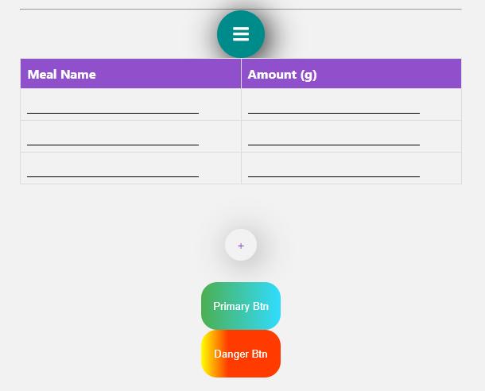
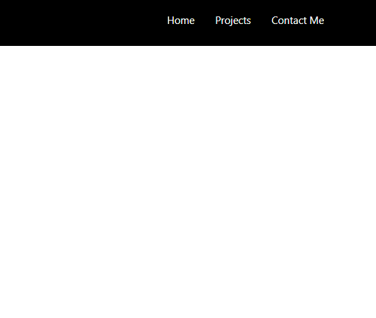

# Jaguar Library 😼
Jaguar is a library of front-end, back-end and api components
to build applications in python and javascript fast 

### UI Components
The library contains navigation bars and various other components ready to be edited ✏️

